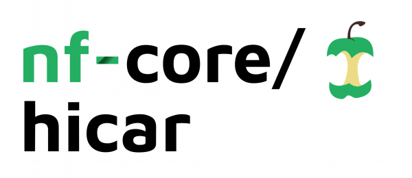

# 

**This pipeline analyses data for HiCAR data, a robust and sensitive multi-omic co-assay for simultaneous measurement of transcriptome, chromatin accessibility and cis-regulatory chromatin contacts**.

[](https://github.com/nf-core/hicar/actions)
[](https://github.com/nf-core/hicar/actions)
[](https://www.nextflow.io/)

[](https://bioconda.github.io/)
[](https://hub.docker.com/r/nfcore/hicar)
[](https://nfcore.slack.com/channels/hicar)

## Introduction

<!-- TODO nf-core: Write a 1-2 sentence summary of what data the pipeline is for and what it does -->
**nf-core/hicar** is a bioinformatics best-practise analysis pipeline for

The pipeline is built using [Nextflow](https://www.nextflow.io), a workflow tool to run tasks across multiple compute infrastructures in a very portable manner. It comes with docker containers making installation trivial and results highly reproducible.

## Quick Start

1. Install [`nextflow`](https://nf-co.re/usage/installation)

2. Install any of [`Docker`](https://docs.docker.com/engine/installation/), [`Singularity`](https://www.sylabs.io/guides/3.0/user-guide/), [`Podman`](https://podman.io/), [`Shifter`](https://nersc.gitlab.io/development/shifter/how-to-use/) or [`Charliecloud`](https://hpc.github.io/charliecloud/) for full pipeline reproducibility _(please only use [`Conda`](https://conda.io/miniconda.html) as a last resort; see [docs](https://nf-co.re/usage/configuration#basic-configuration-profiles))_

3. Download the pipeline and test it on a minimal dataset with a single command:

    ```bash
    nextflow run nf-core/hicar -profile test,<docker/singularity/podman/shifter/charliecloud/conda/institute>
    ```

    > Please check [nf-core/configs](https://github.com/nf-core/configs#documentation) to see if a custom config file to run nf-core pipelines already exists for your Institute. If so, you can simply use `-profile <institute>` in your command. This will enable either `docker` or `singularity` and set the appropriate execution settings for your local compute environment.

4. Start running your own analysis!

    <!-- TODO nf-core: Update the example "typical command" below used to run the pipeline -->

    ```bash
    nextflow run nf-core/hicar -profile <docker/singularity/podman/shifter/charliecloud/conda/institute> --input 'design.csv' --genome GRCh37
    ```

See [usage docs](https://nf-co.re/hicar/usage) for all of the available options when running the pipeline.

## Pipeline Summary

By default, the pipeline currently performs the following:

<!-- TODO nf-core: Fill in short bullet-pointed list of default steps of pipeline -->

* Sequencing quality control (`[FastQC](https://www.bioinformatics.babraham.ac.uk/projects/fastqc/)`)
* Trim reads (`[cutadapt](https://cutadapt.readthedocs.io/en/stable/)`)
* Map reads (`[bwa mem](http://bio-bwa.sourceforge.net/bwa.shtml)`)
* Filter reads (`[pairtools](https://pairtools.readthedocs.io/en/latest/)`)
* Quality analysis (`[pairsqc](https://github.com/4dn-dcic/pairsqc)`)
* Create cooler files for visualization (`[cooler](https://cooler.readthedocs.io/en/latest/index.html)`)
* Call peaks for ATAC reads (R2 reads) (`[MACS2](https://macs3-project.github.io/MACS/)`)
* Find TADs and loops (`[MAPS](https://github.com/ijuric/MAPS)`)
* Differential analysis (`[baySeq](https://bioconductor.org/packages/baySeq/)`)
* Annotation TADs and loops (`[ChIPpeakAnno](https://bioconductor.org/packages/ChIPpeakAnno/)`)
* Overall pipeline run summaries (`[MultiQC](https://multiqc.info/)`)

## Documentation

The nf-core/hicar pipeline comes with documentation about the pipeline: [usage](https://nf-co.re/hicar/usage) and [output](https://nf-co.re/hicar/output).

<!-- TODO nf-core: Add a brief overview of what the pipeline does and how it works -->

## Credits

nf-core/hicar was originally written by Jianhong Ou, Yu Xiang, Yarui Diao.

We thank the following people for their extensive assistance in the development
of this pipeline:

<!-- TODO nf-core: If applicable, make list of people who have also contributed -->

## Contributions and Support

If you would like to contribute to this pipeline, please see the [contributing guidelines](.github/CONTRIBUTING.md).

For further information or help, don't hesitate to get in touch on the [Slack `#hicar` channel](https://nfcore.slack.com/channels/hicar) (you can join with [this invite](https://nf-co.re/join/slack)).

## Citations

<!-- TODO nf-core: Add citation for pipeline after first release. Uncomment lines below and update Zenodo doi. -->
<!-- If you use  nf-core/hicar for your analysis, please cite it using the following doi: [10.5281/zenodo.XXXXXX](https://doi.org/10.5281/zenodo.XXXXXX) -->

You can cite the `nf-core` publication as follows:

> **The nf-core framework for community-curated bioinformatics pipelines.**
>
> Philip Ewels, Alexander Peltzer, Sven Fillinger, Harshil Patel, Johannes Alneberg, Andreas Wilm, Maxime Ulysse Garcia, Paolo Di Tommaso & Sven Nahnsen.
>
> _Nat Biotechnol._ 2020 Feb 13. doi: [10.1038/s41587-020-0439-x](https://dx.doi.org/10.1038/s41587-020-0439-x).

In addition, references of tools and data used in this pipeline are as follows:

<!-- TODO nf-core: Add bibliography of tools and data used in your pipeline -->
* [Cutadapt](http://dx.doi.org/10.14806/ej.17.1.200)
  > Marcel Martin. Cutadapt Removes Adapter Sequences From High-Throughput Sequencing Reads. doi: 10.14806/ej.17.1.200

* [BWA](https://www.ncbi.nlm.nih.gov/pubmed/19451168/)
  > Li H, Durbin R. Fast and accurate short read alignment with Burrows-Wheeler transform. Bioinformatics. 2009 Jul 15;25(14):1754-60. doi: 10.1093/bioinformatics/btp324. Epub 2009 May 18. PubMed PMID: 19451168; PubMed Central PMCID: PMC2705234.

* [BEDTools](https://www.ncbi.nlm.nih.gov/pubmed/20110278/)
  > Quinlan AR, Hall IM. BEDTools: a flexible suite of utilities for comparing genomic features. Bioinformatics. 2010 Mar 15;26(6):841-2. doi: 10.1093/bioinformatics/btq033. Epub 2010 Jan 28. PubMed PMID: 20110278; PubMed Central PMCID: PMC2832824.

* [SAMtools](https://www.ncbi.nlm.nih.gov/pubmed/19505943/)
  > Li H, Handsaker B, Wysoker A, Fennell T, Ruan J, Homer N, Marth G, Abecasis G, Durbin R; 1000 Genome Project Data Processing Subgroup. The Sequence Alignment/Map format and SAMtools. Bioinformatics. 2009 Aug 15;25(16):2078-9. doi: 10.1093/bioinformatics/btp352. Epub 2009 Jun 8. PubMed PMID: 19505943; PubMed Central PMCID: PMC2723002.

* [UCSC tools](https://www.ncbi.nlm.nih.gov/pubmed/20639541/)
  > Kent WJ, Zweig AS, Barber G, Hinrichs AS, Karolchik D. BigWig and BigBed: enabling browsing of large distributed datasets. Bioinformatics. 2010 Sep 1;26(17):2204-7. doi: 10.1093/bioinformatics/btq351. Epub 2010 Jul 17. PubMed PMID: 20639541; PubMed Central PMCID: PMC2922891.

* [cooler](https://pubmed.ncbi.nlm.nih.gov/31290943/)
  > Abdennur N, Mirny LA. Cooler: scalable storage for Hi-C data and other genomically labeled arrays. Bioinformatics. 2020 Jan 1;36(1):311-316. doi: 10.1093/bioinformatics/btz540. PMID: 31290943.

* [MACS2](https://www.ncbi.nlm.nih.gov/pubmed/18798982/)
  > Zhang Y, Liu T, Meyer CA, Eeckhoute J, Johnson DS, Bernstein BE, Nusbaum C, Myers RM, Brown M, Li W, Liu XS. Model-based analysis of ChIP-Seq (MACS). Genome Biol. 2008;9(9):R137. doi: 10.1186/gb-2008-9-9-r137. Epub 2008 Sep 17. PubMed PMID: 18798982; PubMed Central PMCID: PMC2592715.

* [MAPS](https://pubmed.ncbi.nlm.nih.gov/30986246/)
  > Juric I, Yu M, Abnousi A, Raviram R, Fang R, Zhao Y, Zhang Y, Qiu Y, Yang Y, Li Y, Ren B, Hu M. MAPS: Model-based analysis of long-range chromatin interactions from PLAC-seq and HiChIP experiments. PLoS Comput Biol. 2019 Apr 15;15(4):e1006982. doi: 10.1371/journal.pcbi.1006982. PMID: 30986246; PMCID: PMC6483256.

* [GenMap](https://pubmed.ncbi.nlm.nih.gov/32246826/)
  > Pockrandt C, Alzamel M, Iliopoulos CS, Reinert K. GenMap: ultra-fast computation of genome mappability. Bioinformatics. 2020 Jun 1;36(12):3687-3692. doi: 10.1093/bioinformatics/btaa222. PMID: 32246826; PMCID: PMC7320602.

* [baySeq](https://pubmed.ncbi.nlm.nih.gov/20698981/)
  > Hardcastle TJ, Kelly KA. baySeq: empirical Bayesian methods for identifying differential expression in sequence count data. BMC Bioinformatics. 2010 Aug 10;11:422. doi: 10.1186/1471-2105-11-422. PMID: 20698981; PMCID: PMC2928208.

* [ChIPpeakAnno](https://pubmed.ncbi.nlm.nih.gov/20459804/)
  > Zhu LJ, Gazin C, Lawson ND, Pagès H, Lin SM, Lapointe DS, Green MR. ChIPpeakAnno: a Bioconductor package to annotate ChIP-seq and ChIP-chip data. BMC Bioinformatics. 2010 May 11;11:237. doi: 10.1186/1471-2105-11-237. PMID: 20459804; PMCID: PMC3098059.

* [MultiQC](https://www.ncbi.nlm.nih.gov/pubmed/27312411/)
  > Ewels P, Magnusson M, Lundin S, Käller M. MultiQC: summarize analysis results for multiple tools and samples in a single report. Bioinformatics. 2016 Oct 1;32(19):3047-8. doi: 10.1093/bioinformatics/btw354. Epub 2016 Jun 16. PubMed PMID: 27312411; PubMed Central PMCID: PMC5039924.

* [FastQC](https://www.bioinformatics.babraham.ac.uk/projects/fastqc/)

* [pairsqc](https://github.com/4dn-dcic/pairsqc)

* [pairtools](https://github.com/open2c/pairtools)
